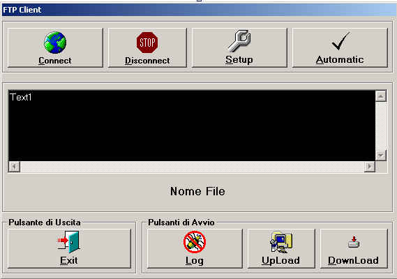



## A Client FTP

### Description

Please VOTE ME!!!! is a sample that implements FTP connection, download, and upload using the WinInet FTP API from Visual Basic. It demonstrates the APIs and techniques to set FTP connection attributes and transfer mode that are not exposed inthe MS Internet Transfer Control.You Can change setting from FTPCLIENT.INI.
 
### More Info
 

             |
---                |---
**Submitted On**   |2003-03-30 11:54:26
**By**             |[Alessandro G](https://github.com/Planet-Source-Code/PSCIndex/blob/master/ByAuthor/alessandro-g.md)
**Level**          |Intermediate
**User Rating**    |4.6 (55 globes from 12 users)
**Compatibility**  |VB 3\.0, VB 4\.0 \(16\-bit\), VB 4\.0 \(32\-bit\), VB 5\.0, VB 6\.0, VB Script
**Category**       |[Complete Applications](https://github.com/Planet-Source-Code/PSCIndex/blob/master/ByCategory/complete-applications__1-27.md)
**World**          |[Visual Basic](https://github.com/Planet-Source-Code/PSCIndex/blob/master/ByWorld/visual-basic.md)
**Archive File**   |[A\_Client\_F1566313302003\.zip](https://github.com/Planet-Source-Code/alessandro-g-a-client-ftp__1-42414/archive/master.zip)

